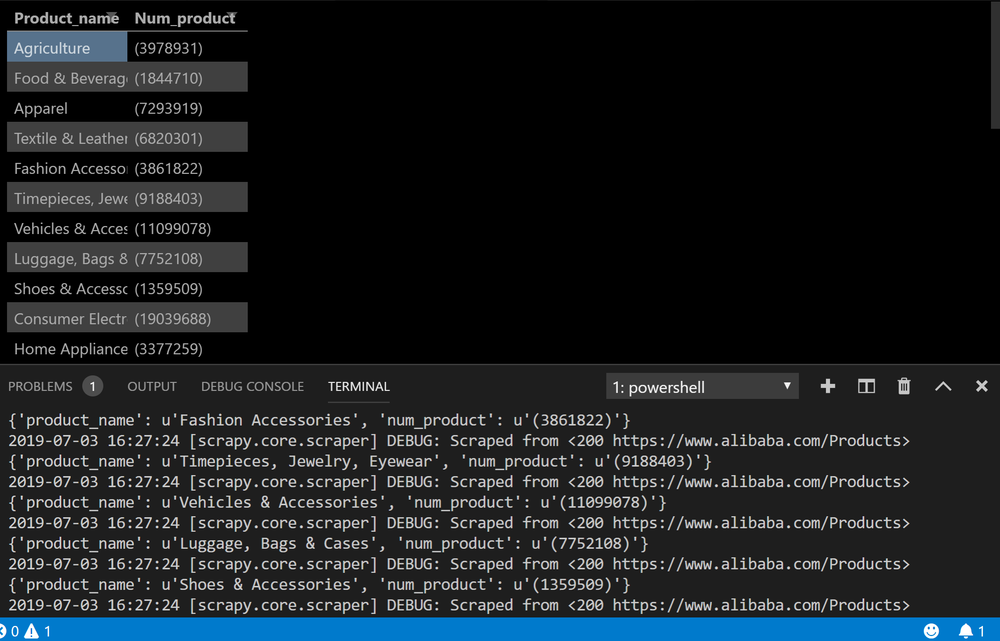

# Scrapy-Alibaba-Ecommerce

A scrapy spider to extract the number of products in each category from alibaba.com.

For Example:




### Prerequisites

* Scrapy

### Installation

1. Clone the repo
```sh
git clone https:://github.com/udit1999/Web_Scrap_e-commerce.git
```
2. Install Python packages
```sh
pip install -r requirements.txt
```
 
3. To install Scrapy using conda, run:
 ```sh
 conda install -c conda-forge scrapy
 ```
   Note: Scrapy is pre-installed with conda. If it is not, then only do this step.
 
4. Alternatively, if you’re already familiar with installation of Python packages, you can install Scrapy and its dependencies from PyPI with:
```sh
pip install Scrapy
```
### Usage 

1. To run the crawler(spider):
```sh
scrapy crawl -o alibaba.csv product_crawler
```
